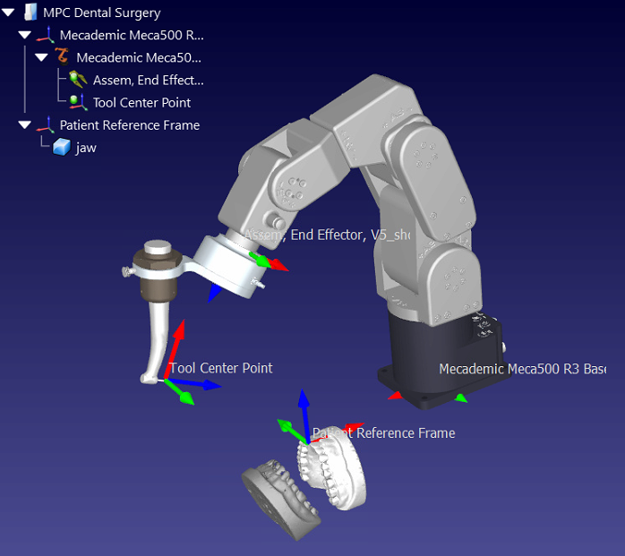

# Constrained Trajectory Planning for Dental Surgery

---
>Name: Hanbyeol Yoon

>E-mail: hanbyeol.yoon@ucla.edu

>date: 2022-10-21


<!--
ABSTRACT
1. In tooth prep in dental surgery, it is important to acheive accuracy and speed.
2. However, dentists have done manually but the robot arm has to be commanded manually all trajectories.
3. In this paper, we would like to propose rl-based planner for dental surgery specifically tooth prep for crown
4. To automate this procedure with rl agent in simulator and impose the traj in real world to make to robot arm follow
5. how: RoboDK with robot and tool info + openAI gym for trial and error to find the best traj while avoiding various types of obstaacles in patient jaw. 
6. brief result - expected result: we will simulate and visualize in the simulation that the trajectory has been generated in 
engineer-manually hard coded trajectory 
evaluate time, accuracy and safety(obstacale avoidance etc)
hopefully run in the real robot arm for evaluation as well
Keyword, path planning, obstacle avoidance, dental surgical robotics, reinforcement learning

> With advancement in robotic technologies, in the field of medical surgery, artificial intelligence (AI) and machine learning (ML) plays a pivotal role in medical imaging, prognosis/diagnosis, treatment assistant, and automation of repetitive subtasks of surgery. However, specifically in dental surgery, reinforcement learning (RL) has not been actively applied while it has a lot in common with robot machining where RL is widely used for fully-automated trajectory generation. Therefore, in this article, by developing an RL-based tool trajectory planner, we would like to enable robot arm to automatically perform a few subtasks in dental surgery such as tooth preparation for crown through removal of cavity. We will use CopelliaSim for simulation environments, Python/Pytorch for RL, and MATLAB for robotics. The expected result of this project would be a RL-based, collision-free, fully-automated dental tool trajectory generation algorithm.
-->
<!--more-->
{: class="table-of-content"}
* [Introduction](#introduction)
* [Background](#background)
    * [Tooth Preparation for Crown](#tooth-preparation-for-crown)
    * [Kinematics and Dynamics of Robotics](#kinematics-of-robotics)
    * [Model Predictive Control](#reinforcement-learning)
* [Methodology](#methodology)
    * [Simulation Environment](#interaction-environment)
    * [Model Predictive Control](#reward-function)
        * [Objective Function]
        * [Constraints]
        * [Dynamics]
* [Results](#results)
    * [Experimental Setup](#experimental-setup)
    * [Experimental Results](#experimental-results)
    * [Analysis and Evaluation](#analysis-and-evaluation)
* [Conclusions](#conclusion)
* [References](#references)

## Introduction
With the advent of an aging society and the advancement in robotic technologies, dentistry industry becomes one of the biggest markets in the field of robotics. Since various surgeries in dentistry involve high-precision and repetitive tasks, robot technologies have significant potential and ability to assist dentists or perform certain types of tasks better than human practitioners. Many researches have been conducted applying the robot technologies to dentistry such as maxillofacial surgery [[1-3]](#reference), tooth preparation [[4-5]](#reference), and robot assistant [[6]](#reference).

In our project, we would like to apply Model Predictive Control (MPC) to achieve contrained trajectory planning for subtasks in dental surgery. To be specific, we will propose an MPC trajectory planner for a robot arm to accomplish automated tooth preparation for crown while robustly tracking moving patient and avoiding obstacles inside jaw. The expected deliverables of our project is summarized as follow:
- Simulation environment of dental surgery with a robot and a patient
- Robust trajectory tracking with perturbed target (movement of patient)
- Guarantee of collision-free procedure with constrained trajectory planning

The structure of the rest of the article is as follow: 1) background for tooth preparation for crown, kinematics of robotics, and reinforcement learning, 2) methodology we use for this project, 3) result of the simulation of rl-based trajectory planner, and 4) conclusion.
<!--
Your article starts here. You can refer to the [source code](https://github.com/lilianweng/lil-log/tree/master/_posts) of [lil's blogs](https://lilianweng.github.io/lil-log/) for article structure ideas or Markdown syntax. We've provided a [sample post](https://ucla-rlcourse.github.io/CS269-projects-2022fall/2017/06/21/an-overview-of-deep-learning.html) from Lilian Weng and you can find the source code [here](https://github.com/ucla-rlcourse/CS269-projects-2022fall/blob/main/_posts/2017-06-21-an-overview-of-deep-learning.md)-->

## Background
### Tooth Preparation for Crown
- explanation on tooth preparation procedure for crown in dentistry
- define a few number of waypoints
- assume we have geometry information about jaw (environmnet obstacle knowledge)


{: style="width: 400px; max-width: 100%;"}
*Fig 2. Tooth Preparation Procedure for Crown. (Image source: <https://www.dndentalcare.com/crowns.html>)*
<!--
Please create a folder with the name of your team id under `/assets/images/`, put all your images into the folder and reference the images in your main content.

You can add an image to your survey like this:

{: style="width: 400px; max-width: 100%;"}
*Fig 1. YOLO: An object detection method in computer vision* [1].

Please cite the image if it is taken from other people's work.-->


### Kinematics and Dynamics of Robotics
- explanation on kinematics of robotics e.g. how tool trajectory is converted into a set of joint angles of a robot arm.
- explanation on dynamics of robotics in joint space
- explanation on dynamcis of robotics in task space


{: style="width: 400px; max-width: 100%;"}
*Fig 3. Yomi: commercial implantology robot arm. (Image source: <https://www.neocis.com>)*
<!--
Here is an example for creating tables, including alignment syntax.

|             | column 1    |  column 2     |
| :---        |    :----:   |          ---: |
| row1        | Text        | Text          |
| row2        | Text        | Text          |
-->


### Model Predictive Control
- explanation on our method MPC
<!--
```
# This is a sample code block
import torch
print (torch.__version__)
```


### Formula
Please use latex to generate formulas, such as:

$$
\tilde{\mathbf{z}}^{(t)}_i = \frac{\alpha \tilde{\mathbf{z}}^{(t-1)}_i + (1-\alpha) \mathbf{z}_i}{1-\alpha^t}
$$

or you can write in-text formula $$y = wx + b$$.

### More Markdown Syntax
You can find more Markdown syntax at [this page](https://www.markdownguide.org/basic-syntax/).
-->
## Methodology

### Simulation Environment
We will use RoboDK, and MATLAB for this project.



{: style="width: 400px; max-width: 100%;"}
*Fig 4. The relation chart of the simulation environment.* [[15]](#reference)

### Model Pedictive Control
#### Objective Function
#### Constraints
#### Dynamics / Kinematics

## Results
Simulation of trajectory planner and evaluate the result by analyzing error.
### Experimental Setup
### Experimental Results
### Analysis and Evaluation

## Conclusion

## Reference
<!--maxillofacial surgery-->
[1] Sun X, McKenzie FD, Bawab S, Li J, Yoon Y, Huang JK. "Automated dental implantation using image-guidedrobotics: registration results." Int J Comput Assist RadiolSurg 2011;6:627–34.

[2] Zhenggang C, Qin C, Fan S, Yu D, Wu Y, Chen X. "Pilot studyof a surgical robot system for zygomatic implantplacement." Med Eng Phys 2019.

[3] Woo S-Y, Lee S-J, Yoo J-Y, Han J-J, Hwang S-J, Huh K-H, et al. "Autonomous bone reposition around anatomical landmarkfor robot-assisted orthognathic surgery." J Cranio-MaxillofacSurg 2017;45:1980–8.

<!--tooth prep-->
[4] Otani T, Raigrodski A, Mancl L, Kanuma I, Rosen J. "In vitroevaluation of accuracy and precision of automated robotictooth preparation system for porcelain laminate veneers." JProsthetic Dent 2015:114.

[5] Yuan, Fusong, and Peijun Lyu. "A preliminary study on a tooth preparation robot." Advances in Applied Ceramics 119.5-6 (2020): 332-337.

<!--robot assistant-->
[6] Grischke J, Johannsmeier L, Eich L, Haddadin S. "Dentronics:first concepts and pilot study of a new application domainfor collaborative robots in dental assistance." In: 2019 international conference on robotics and automation(ICRA). 2019.

---

<!--
## Data Rich and Physics Certain

| Experiment 					| Parameters  											| Results  								| Comments 							|
| :---       					|    :----:   											|     :---: 							|     ---: 							|
| **DL + Data**																																						|

| Predicting only velocity  	| Dataset size : 10000<br> Network : 2->5->5->1 <br> activation: ReLU	|  ~100% accurate	| Generalises well over various initial velocities |
| Predicting only displacement 	| Dataset size : 10000<br> Network : 2->16->16->1 <br>	activation: ReLU |	Reasonable		| Better prediction for $u_0 \in dataset$, average prediction outside | 
| Predicting both $v_t, s_t$	| Dataset size : 10000<br> Network : 2->16->16->2 <br>	activation: tanh	|	Reasonable		| Better prediction for $u_0 \in dataset$, poor prediction outside |

-----

| **DL + Physics**																																			|
| Predicting both $v_t, s_t$, using Loss $L_{physics} = \|v_{predicted}^2-u_{initial}^2-2*g*s_{predicted}\|$ | Dataset size : 10000<br> Network : 2->16->16->1 <br>	activation: ReLU |	~0% accuracy		| Expected result as no supervision of any kind is provided |
| Predicting both $v_t, s_t$, using Loss $L_{velocity+phy} = (v_{predicted}-v_{actual})^2+\gamma*(v_{predicted}^2-u_{initial}^2-2*g*s_{predicted})^2$ | Dataset size : 10000<br> Network : 2->16->16->1 <br>	activation: ReLU |	Reasonable	| Prediction of $v_t$ is good. Was able to learn $s_t$ reasonably well without direct supervision |
| Predicting both $v_t, s_t$, using Loss $L_{supervised+phy} = (v_{predicted}-v_{actual})^2+(s_{predicted}-s_{actual})^2+\gamma*(v_{predicted}^2-u_{initial}^2-2*g*s_{predicted})^2$ | Dataset size : 10000<br> Network : 2->16->16->1 <br>	activation: ReLU |	Reasonable	| Not a better result w.r.t direct supervision |


**Observations :** 
- Physics equations are certain in this case and are the best to use.
- Both DL, Hybrid(DL+Physics) methods performance are equivalent (actual accuracy/loss varies based on fine training, random dataset generation)

Re running the above experiments with Dataset size of 200(Data Starvation), yielded the following observations
- DL performance is comparable with 10000 dataset when trained on much mode epochs(5x)
- Hybrid(DL+Physics) without direct supervision on $s_t$ has comparable/better closeness than DL only method for limited epochs($\sim$300) training.


## Data Rich and Physics Uncertain

| Experiment 					| Parameters  											| Results  								| Comments 							|
| :---       					|    :----:   											|     :---: 							|     ---: 							|
| **DL + Data**																																						|\
| Predicting both $v_t, s_t$	| Dataset size : 10000<br> Network : 2->16->16->2 <br>	activation: tanh	|	Reasonable		| Better prediction for $u_0 \in dataset$, poor prediction outside |
| **DL + Physics**																																			|
| Predicting both $v_t, s_t$<br> using Loss $L_{physics} = \|v_{predicted}^2-u_{initial}^2-2*g*s_{predicted}\|$ | Dataset size : 10000<br> Network : 2->16->16->1 <br>	activation: ReLU |	~0% accuracy		| Expected result as no supervision of any kind is provided |
| Predicting both $v_t, s_t$<br> using Loss $L_{velocity+phy} = (v_{predicted}-v_{actual})^2+\gamma*(v_{predicted}^2-u_{initial}^2-2*g*s_{predicted})^2$ | Dataset size : 10000<br> Network : 2->16->16->1 <br>	activation: ReLU |	Reasonable	| Prediction of $v_t$ is good. Was able to learn $s_t$ reasonably well without direct supervision |
| Predicting both $v_t, s_t$<br> using Loss $L_{supervised+phy} = (v_{predicted}-v_{actual})^2+(s_{predicted}-s_{actual})^2+\gamma*(v_{predicted}^2-u_{initial}^2-2*g*s_{predicted})^2$ | Dataset size : 10000<br> Network : 2->16->16->1 <br>	activation: ReLU |	Reasonable	| Not a better result w.r.t direct supervision, but bettr than DL when $u0$ is out of dataset |


**Observations :** 
- Both DL, Hybrid(DL+Physics) methods performance are similar, Hybrid(DL+Physics) is better when $u0$ is out of dataset, DL is better for $u0$ in dataset.
- Physics equations are not certain in this case and the above methods are better to use than Physics.

## Data Starvation and Physics Uncertain
- Similar observations as in data rich
-->

